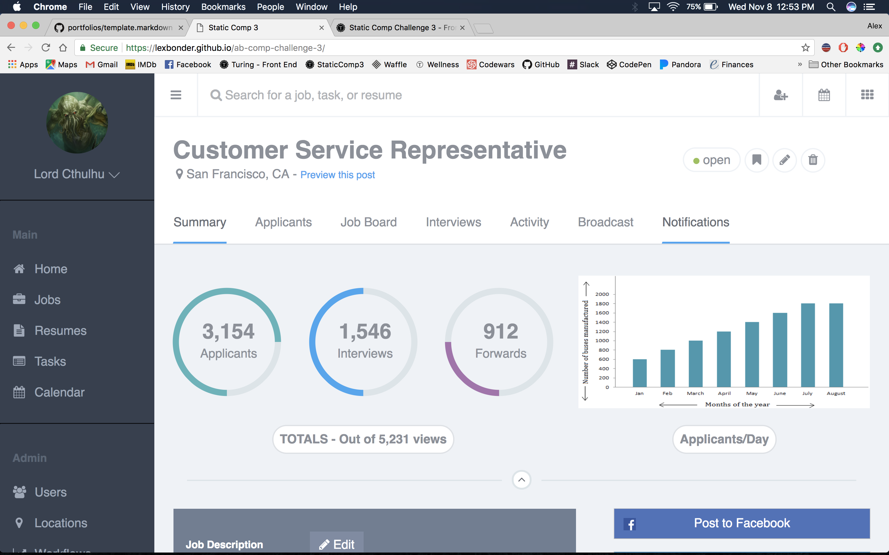
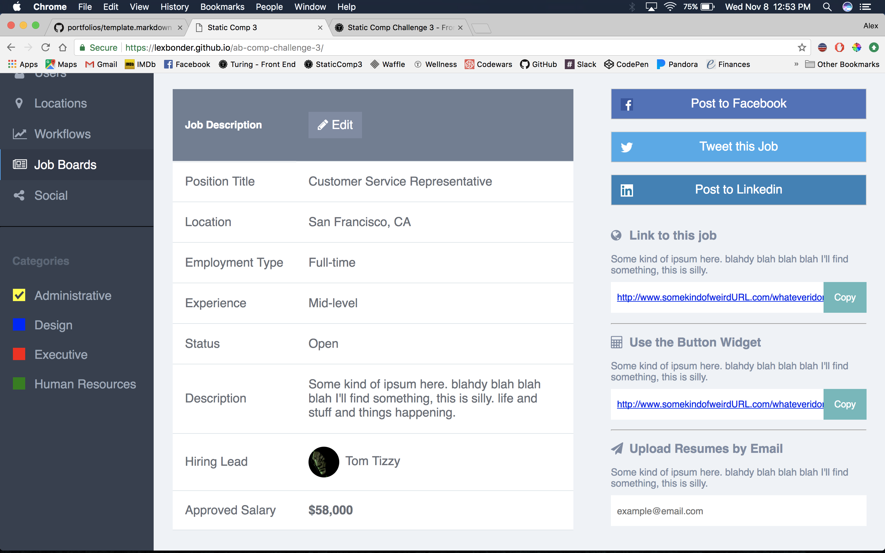

# Static Comp 3 - Alex Bonder - (FE Mod 1)

## Synopsis

  The job for this project was to replicate the design given to us in the comp and make it reponsive for both large and small screens. This time I didn't focus much on the creative aspect and spent more time making sure that my work looked like the comp.

  Some points of feedback I recieved were to focus on getting more aria labels into my code, and sift through the CSS to see if I had any unneccesary statements to clean out my CSS.
  
## Project Goals

* Match the structure of the original comp
* Make the site responsive

## Installation

Fork or clone this project

Open `index.html`

# Original Comp

# My Comp

